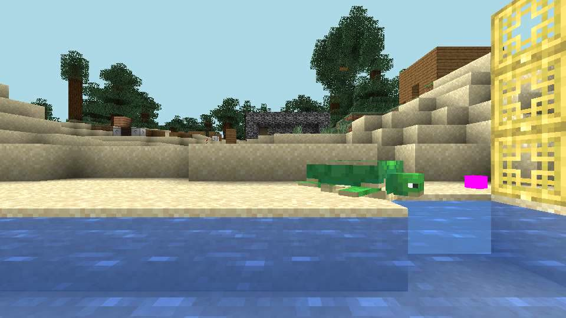
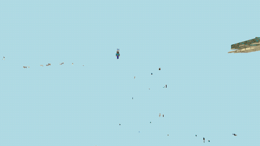
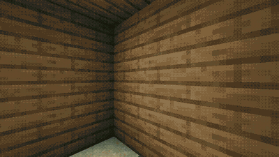
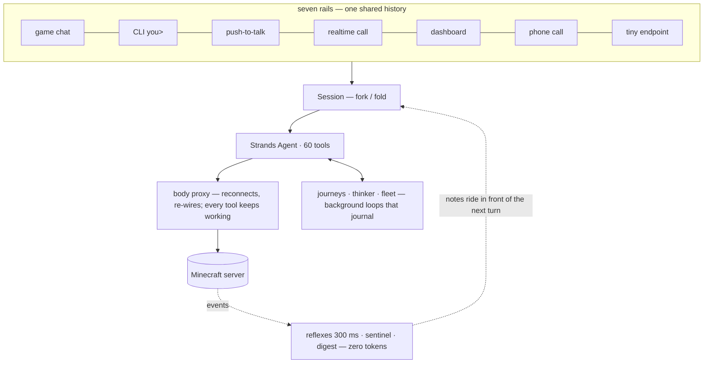

<h1 align="center">strands-minecraft</h1>

<p align="center"><b>Give an LLM a body.</b> A Minecraft bot that is a real <a href="https://github.com/strands-agents/sdk-typescript">Strands</a> agent: it perceives, acts, remembers, pursues long goals, defends itself, hires help, survives being kicked — and answers you by text, game chat, voice, or from your phone.</p>

<p align="center">
  <a href="https://github.com/cagataycali/strands-minecraft/actions/workflows/ci.yml"></a>
  
  
  
  
  
</p>

<p align="center">
  <a href="https://cagataycali.github.io/strands-minecraft/">Landing</a> ·
  <a href="#install-in-60-seconds">Install</a> ·
  <a href="#ten-minutes-with-it">Ten minutes</a> ·
  <a href="#it-stays-alive-without-the-model">Alive</a> ·
  <a href="#the-tools--60-covering-100-of-mineflayer">Tools</a> ·
  <a href="#talk-to-it--seven-rails-one-history">Talk to it</a> ·
  <a href="#grow-it--a-crew-a-second-bot-the-knobs">Grow it</a> ·
  <a href="#understand-it--the-map-and-the-findings">Understand it</a> ·
  <a href="#faq">FAQ</a> ·
  <a href="CONTRIBUTING.md">Contributing</a>
</p>

<table>
<tr>
<td width="52%" valign="top"></td>
<td valign="top">

**You type → it does**

`you> fell that tree and make a pickaxe`<br>
→ `find_blocks` · `dig_vein` · `craft_item` — logs → planks → sticks → pickaxe, one call

`you> keep mining until you have 64 iron`<br>
→ `start_journey` — a background loop: step, journal, cool down, report

`you> hire two diggers and clear this hill`<br>
→ `manage_bots` — each worker its own connection, agent and reflexes

*a creeper hisses behind it*<br>
→ the 300 ms reflex sprints **before** the model wakes — zero tokens

</td>
</tr>
</table>

*For anyone who wants to watch an agent work in a world with physics — and for Strands developers
who want a reference body with every rail (chat, CLI, voice, phone, web, tiny) already wired.*

## Install in 60 seconds

**Docker — the whole rig** (Minecraft server + bot + dashboard on `:3008`):
```bash
git clone https://github.com/cagataycali/strands-minecraft && cd strands-minecraft
cp .env.example .env        # model credentials (AWS_* for Bedrock by default)
docker compose up -d        # server + bot · dashboard on :3008
docker attach strands-bot   # the you> prompt (detach: ctrl-p ctrl-q)
```

An OOM'd or kicked bot **restarts itself** (`restart: unless-stopped`); world, passkeys and
waypoints live on volumes. `--profile tunnel` adds a Cloudflare tunnel. `MC_HOST` in `.env` points
it at an existing server instead (`host.docker.internal` = your machine).

**Bare metal** — required for the voice rails (mic and speakers don't cross containers):
```bash
npm install && cp .env.example .env     # MC_HOST / MC_PORT: any server, or Java Edition → Open to LAN
npm start                               # bot joins, you> prompt opens
npx strands-minecraft                   # or: the same thing from any directory with a .env
```

Something off? [FAQ](#faq).

## What it does

Three years ago this was [a chat relay](https://github.com/TinyAI-ID/tinyai-id-minecraft-ai-agent-example)
— an LLM that could only *talk*. This is the remaster: say "build a cabin" and it fells the spruce,
collects the drops, crafts the planks and builds, reporting progress in chat while you do something
else. *Every image here is the bot's own first-person view, recorded off its live dashboard.*

| "dig the blocks in front of you, then put them back" | creeper encounter, uninstructed |
|---|---|
|  |  |

Built on [Strands](https://github.com/strands-agents/sdk-typescript) +
[mineflayer](https://github.com/PrismarineJS/mineflayer), with **100% of mineflayer's game mechanics
as tools** ([the audit](COVERAGE.md)). Bedrock / Claude by default; OpenAI or Anthropic with one env
var ([configuration](#configuration)).

- **Fork/fold concurrency** — every rail talks through one `Session`; concurrent asks run on *forks*
  of the history and fold back. Nothing blocks, nothing corrupts, nobody waits. When a provider
  refuses, the failure is legible: exception class named, transcript dumped as shape only
  (`u+t a[use:a1b2 dig_block] u[res:a1b2]` — ids, never content), a split tool pair called out by
  id, and a throttle buys one retry that resumes from history rather than re-asking.
- **Journeys** — "keep mining until you have 64 iron" becomes a background agent that steps,
  journals, cools down 3 s, repeats (≤ 500 steps / 2 h). Ask questions *while* it works.
- **A thinker** — every 90 s idle it reflects and does housekeeping; during a journey it turns
  supervisor: reads the journal, restarts stalled errands sharper. Workers are supervised in both
  modes.
- **Reflexes & senses** — a 300 ms LLM-free spinal cord dodges creepers, lava and death *before* the
  model wakes; a sentinel (radar 16 blocks, polled every second) narrates what matters.
  [Below](#it-stays-alive-without-the-model).
- **A fleet** — `manage_bots` hires worker bots: own connection, agent, legs and reflexes, a
  journaled task loop (≤ 60 steps / 30 min), no headcount cap. Workers load view distance 3 — 81
  chunk columns — so three of them cost less RAM than one player client.
- **A body that heals** — the signed-chat kick (mineflayer#3838) is survived by a proxy body:
  reconnects, re-wires, every tool keeps working.
- **Real eyes** — `capture_view` screenshots a headless first-person renderer; the model *sees* what
  it built before saying "done".

## Ten minutes with it

The `you>` prompt in the real log grammar (`src/index.ts`); `# →` lines name the tools each turn
calls:

```text
you> fell that spruce and make me a pickaxe
# → find_blocks name=spruce_log · dig_vein x,y,z · craft_item item=wooden_pickaxe
🤖 Spruce down, six logs swept. Planks → sticks → pickaxe, done. You're holding it.

you> keep mining until you have 64 iron, I'll be around
# → start_journey goal="mine until 64 iron_ingot in inventory"
🤖 On it — journey jm3kq2 started. Ask me anything while I dig.
🧭 [jm3kq2 #1] find_blocks iron_ore,deepslate_iron_ore exposed=false → 3 veins; tunnelling  [Δ +9 cobblestone]
🧭 [jm3kq2 #2] dig_vein at (118, 42, -37) → 5 raw_iron  [Δ +5 raw_iron, moved 21m]

you> where's the nearest village?
⑂ forking (1 turn(s) in flight)
🤖 No village in view distance. Last one I remembered: 'village' at (301, 64, -12) — recall_places has it.

👂 heard entity.creeper.primed at (121, 43, -35)
⚡ reflex: creeper_flee
🤖 Creeper behind me — sprinted clear, no damage. Back to the vein.

you> hire two diggers and clear the hill north of me
# → manage_bots action=hire name=Chopper task=… · manage_bots action=hire name=Digger task=…
👥 [Chopper #2] dig_vein (130, 66, -44) → 12 dirt  [Δ +12 dirt]
👥 [Digger #1] go_to (134, 66, -48) reached; digging the ridge line

you> what does the hill look like now?
# → capture_view
🤖 Flat to y=64, grass line intact, Chopper's still on the east lip. Two more passes.
```

Every tool and parameter above exists ([the table](#the-tools--60-covering-100-of-mineflayer)); the
`[Δ …]` tail is measured from the body, not from the model's account of itself.



## It stays alive without the model

A language model is a fine mind and a terrible brainstem: a creeper detonates in ~1.5 s, and no
model round-trip wins that race. So the bot layers its nervous system the way animals do — fast dumb
loops under a slow smart one:

| layer | speed | what it does |
|---|---|---|
| ⚡ **Reflexes** | 300 ms tick, zero tokens | Lava/fire → water bucket or flee. About to die → disengage. Creeper in blast radius → sprint. Stuck 20 s → shake loose. Idle: eat, wear better armor, grab drops, face passers-by (never endermen), step out of your personal space. |
| 👂 **Sentinel** | event-driven, zero tokens | Hears primed TNT/creepers (exact blast position, ~1.5 s fuse), radar-tracks hostiles to 16 blocks, names your attacker, notices dusk, players joining, chests opened behind your back, someone digging into your base (aggregated per digger, with a count), low vitals — and tells the agent in ONE edge-triggered note, not a packet firehose. |
| 📋 **Digest** | per self-prompt | Every thinker cycle and journey step opens with an ≤8-line status block (vitals, threats, bag, journey, workers, what the body did on its own) — the model reasons from state instead of spending a tool call asking. |
| 🧭 **Critic & ledgers** | per journey step | Each step's journal line gets a measured `[Δ +12 cobblestone, -2 hp, moved 34m]` tail — narration can't hide a stall. Finished goals land in a `completed` ledger, failures in `too_hard`; the idle thinker proposes the next tech-tree step and never re-proposes a known failure. |

Safety reflexes may yank the pathfinder from under a journey step — pain beats plans — and the model
gets one digest note afterwards. Idle reflexes wait until nothing deliberate is happening. Workers
inherit the safety set. Knobs: `REFLEX_MODES_DISABLED`, `REFLEX_MODES_OFF=item_magnet,idle_staring`,
`REFLEX_TICK_MS`, `SENTINEL_DISABLED`.

**Tell it who you are:** `TRUSTED_PLAYERS=YourName,Friend`. Base security is written for griefers,
so without a list it reports *you* mining your own tunnel — once per block, aloud. Trusted hands
stay a log line; a stranger digging near a waypoint gets **one** note per base with a block count
(`— 14 blocks so far`), then silence until one escalation (`SECURITY_SETTLE_MS`,
`SECURITY_QUIET_MS`).

## The tools — 60, covering 100% of mineflayer

[COVERAGE.md](COVERAGE.md) maps every mineflayer capability to a tool or an explicit N/A. The matrix
is the contract: **if mineflayer can do it, the agent can.**

| | |
|---|---|
| 👀 Perception | get_status · look_around · find_blocks · inspect_block · list_inventory · find_player · read_hud · check_darkness |
| 🦵 Movement | go_to · follow_entity · turn · look_at · move (raw controls) · stop_moving · teleport · mount_entity · dismount · steer_vehicle · **elytra_fly** · creative_fly |
| ⛏️ World | dig_block · **dig_vein** (whole ore vein / tree in one call) · collect_ground_items · place_block · place_entity · **build_blueprint** (JSON plan → structure) · **build_structure** (parametric box/wall/floor/pillar, dry-run material bill) · activate_block · write_sign |
| 🎒 Inventory | equip_item · unequip · toss_item · use_item · **craft_item** (chains log→planks→sticks→tool in one call) · eat · creative_inventory · write_book |
| ⚔️ Combat | attack_entity `until:'dead'` — cooldown-honest, shield between swings, retreat below minHealth |
| 📦 Interaction | container_transact · furnace_transact (fuel %/progress %) · trade_with_villager · sleep_in_bed · wake_up · fish · enchant_item · anvil_use · activate_entity · respawn |
| 🧠 Memory | remember_place · recall_places · forget_place — waypoints that survive restarts, shared with workers |
| 🧭 Meta | start_journey · journey_status · stop_journey · manage_bots · capture_view · say_in_chat · whisper · voice_say · voice_config |

Design rules everywhere: tools **walk into range first**; errors **teach** (unknown block → close
matches, so the agent self-corrects); windows always close in `finally`; no persistent listeners
(tools stay valid across reconnects). Count and domain map are generated from the source
([`docs/numbers.json`](docs/numbers.json)) and pinned by a test.

## Talk to it — seven rails, one history

| Rail | How | What happens |
|---|---|---|
| 💬 **Game chat** | say anything near the bot | hears, thinks, acts, answers in chat |
| ⌨️ **CLI** | type at `you>` | fire-and-forget — queue three things, all run |
| 🎤 **Push-to-talk** | `v`, speak, `v` | mic → Whisper → agent → spoken reply |
| 📞 **Realtime call** | `call` | speech⇄speech, barge-in, tools fire mid-sentence |
| 📱 **Web dashboard** | `minecraft.yourdomain.com` | live first-person video + the agent's whole inner life + a composer, from your phone |
| 🗣 **Phone call** | tap 📞 on the dashboard | the same realtime call, from anywhere — your phone's mic and speaker become the bot's ears and mouth |
| 🔥 **tiny** | `npm run enroll` | the bot is a device of your personal AI at [tiny.technology](https://tiny.technology) — "tiny, tell the bot to cut a tree" from the web, the iPhone or any other device of yours |

All seven land in **one shared history** — the call remembers the chat, the phone remembers the
call.

### The dashboard — your bot as a robot

Live MJPEG of the bot's eyes, an SSE feed of everything it hears/thinks/does, and a composer that
talks straight into the session — phone-first, installable (Add to Home Screen), locked behind
**WebAuthn passkeys**: enroll once, Face ID forever. Reset = `rm .web_auth.json`.

```bash
cloudflared tunnel login && cloudflared tunnel create minecraft
cloudflared tunnel route dns minecraft minecraft.yourdomain.com
cloudflared tunnel run --url http://localhost:3008 minecraft   # or: docker compose --profile tunnel up -d
```

The tunnel isn't sugar: WebAuthn binds passkeys to an HTTPS domain, so the tunnel is what makes Face
ID login possible. First enrollment is the open window — `WEB_BOOTSTRAP_TOKEN` gates it. What the
dashboard guards: [SECURITY.md](SECURITY.md).

### Voice from anywhere

The dashboard's call button dials the **same realtime call** the CLI has: your phone's mic and
speaker become the bot's ears and mouth, over the same tunnel and passkey cookie. The bot can live
in a datacenter with no sound card, because the audio device is the browser (`OPENAI_API_KEY` set,
`VOICE_DISABLED` unset). On the line, its inner life reaches your ears — sentinel danger, journey
and worker outcomes, thinker verdicts, anything it decides to `voice_say` — with the speaking model
deciding what's worth saying aloud. Barge-in works: talk over it and it stops. `voice_config`
switches the voice for the next call.

### Enroll into tiny — the bot as a device

[tiny.technology](https://tiny.technology) is a personal AI that reaches every device you own. The
bot joins as an **endpoint device**: tiny dials OUT to this dashboard, so nothing runs here beyond
the web rail you already have.

```bash
openssl rand -hex 32                      # → TINY_TOKEN=… into .env (≥32 chars)
docker compose up -d --build --no-deps bot
npm run enroll -- --endpoint https://minecraft.yourdomain.com   # = npx tiny-tech enroll --body strands-the-miner
```

`enroll` reads `TINY_TOKEN` from `.env` ([`tiny.body.json`](tiny.body.json) says where: env › `.env`
› the running container), probes `/api/health`, and either uses your tiny session or prints a
6-character code + QR you approve in the tiny iOS app (My devices › Pair a device). Needs
`tiny-tech ≥ 0.20.2`. The row is named after the bot (`MC_USERNAME` lowercased → `strandsbot`); a
re-run re-points the same row. `MINECRAFT_PUBLIC_URL` replaces `--endpoint`; there is no baked-in
default — without either, enroll refuses with the variable's name.

<details>
<summary><b>The six routes tiny calls</b> — <code>/api/health</code> public; telemetry, camera, stream, events, chat, stop take the token as <code>Authorization: Bearer</code>, <code>?token=</code> or your passkey cookie, else <code>401 {ok:false}</code></summary>

| route | gate | what |
|---|---|---|
| `GET /api/health` | public | `{ok, body, name, mc:{host,port,version,connected,epoch}, camera, auth, uptime_s}` — `mc.connected` is the presence rule (dashboard up ≠ bot in the world) |
| `GET /api/telemetry` | token | pos, yaw/pitch, health, food, air, xp, time, weather, biome, gamemode, held, inventory (summed, ≤40), nearby players/hostiles, task, thinker, crew, connection, mem |
| `GET /api/camera/snapshot` | token | one JPEG from the bot's eyes; `X-Camera: live｜warming｜broken: …` |
| `GET /api/stream.mjpeg` · `GET /api/events` | token | aliases of the dashboard's MJPEG and SSE feed |
| `POST /api/chat {prompt, wait_s?}` | token, 5/s | a turn on the same rail as `/api/say`; waits ≤ `wait_s` (20, max 40) → `{ok, reply, turn_id, done, task}`; `done:false` = still working, the answer lands on `/api/events` tagged `replyTo=turn_id` |
| `POST /api/stop` | token, 5/s | halt legs, dig and the running journey → `{ok, stopped:[…]}` (a model turn mid-thought finishes its step) |

`WEB_AUTH_DISABLED=true` still means **loopback only** — from Docker's bridge or the tunnel, every
caller needs the token.
</details>

## Grow it — a crew, a second bot, the knobs

### Run a second bot (and a third…)

Pick by who should be in charge. **A crew serving one agenda** needs zero setup: `manage_bots` is a
tool — *"hire two workers and clear this hill"* spawns `Chopper` and `Digger`, each its own
connection and agent, supervised and dismissed by the boss. **Independent agents** are one compose
project each — own container, ports, passkeys and waypoint memory (volumes are namespaced by project
name):

```bash
docker compose up -d                                   # bot #1, dashboard on :3008

MC_USERNAME=Miner BOT_CONTAINER_NAME=strands-miner \
WEB_PUBLIC_PORT=3018 VIEWER_PUBLIC_PORT=3017 \
docker compose -p miner up -d --no-deps bot            # bot #2 — same checkout
```

- `-p <name>` — separate containers and `bot-state`/`bot-memory` volumes: bot #2 can't eat bot #1's
  passkeys. `--no-deps bot` starts only the bot; it joins the first project's server (or yours:
  `MC_HOST=host.docker.internal`).
- `MC_USERNAME` must differ — a server kicks the older session on a duplicate name. Ports collide →
  the second container won't start. Each bot claims `BOT_MEM_LIMIT` (3g); watch every boot line for
  `🚨 memory ceiling is fiction`.
- One model quota: every idle thinker fires every 90 s. Seeing `Too many tokens, please wait`?
  `THINKER_DISABLED=true` on helpers, `THINKER_INTERVAL_MS=300000` on the boss, or a different
  `STRANDS_MODEL_ID`.
- They share `.env`; inline variables override per instance. `docker attach strands-miner` talks to
  one, `docker compose -p miner down` stops one. In-game they are players: chat near one and it
  answers, whisper to address exactly one. No shared memory or goals — that is what *independent*
  means.

### Configuration

Everything is a `.env` variable with a documented default — `src/config.ts` is the one registry,
[`.env.example`](.env.example) the annotated copy. The ones you'll touch first:

| Var | Default | What |
|---|---|---|
| `MC_HOST` / `MC_PORT` | `localhost` / `25565` | server address |
| `MC_USERNAME` | `StrandsBot` | bot name |
| `MC_AUTH` | `offline` | `microsoft` for online-mode |
| `MC_VERSION` | auto | pin if detection misfires |
| `STRANDS_MODEL_PROVIDER` | `bedrock` | `bedrock` · `openai` · `anthropic` — the last two need their peer package (`npm install openai` / `@anthropic-ai/sdk`; the boot line tells you) |
| `STRANDS_MODEL_ID` | per provider | `global.anthropic.claude-sonnet-5` · `gpt-5.4` · `claude-sonnet-4-6` |
| `AWS_REGION` | `us-west-2` | Bedrock only |
| `OPENAI_API_KEY` | — | push-to-talk + realtime call (CLI + dashboard) |
| `TRUSTED_PLAYERS` | — | who may dig around your bases without a security note |
| `TINY_TOKEN` | — | the tiny endpoint routes (≥32 chars) |
| `WEB_BOOTSTRAP_TOKEN` | — | secret required for the first passkey |

Every other knob — voice (`VOICE_NAME`, `VOICE_REPLIES`), thinker cadence (`THINKER_INTERVAL_MS` 90
s), session window (`SESSION_WINDOW` 120), reflex/sentinel timing, radar and security gaps, memory
ceilings (`BOT_MEM_LIMIT` 3g · `BOT_HEAP_MB` 2048 · `MC_MEMORY` 2G), `MEMORY_DIR` — is documented
inline in [`.env.example`](.env.example), the file you already copied, with its reason in
[`src/config.ts`](src/config.ts).

## Understand it — the map and the findings

The interesting bugs were never in the tools but between turns. Each write-up is a reproduction, a
mechanism and what the tests now pin:

- [docs/findings/](docs/findings/) — eight incidents: the escape-vs-starvation deadlock, phantom
  deaths, a death history clobbered by a waypoint write, an escape claim that expired mid-ladder…
- [MEMORY.md](MEMORY.md) — anatomy of a 4GB OOM: a mineflayer `Bot` is the most expensive object in
  the process, and neither `quit()` nor a capped file write frees one.
- [HARDCODING.md](HARDCODING.md) — what belongs in code (mechanism), `config.ts` (tunable), the
  model (policy).
- [COVERAGE.md](COVERAGE.md) — the mineflayer → tool matrix · [AGENTS.md](AGENTS.md) — the developer
  map.

Layout: `src/index.ts` is the spine (rails, reflexes, CLI — read it first); `src/tools/` the 60
tools by domain; `test/` 74 node:test files on a fake world + fake bot. File by file:
[AGENTS.md → Layout](AGENTS.md#layout).

**Roadmap.** Done: 100% mineflayer coverage · fleet · blueprints · persistent memory · vision ·
reflexes · dashboard · tiny endpoint. Next: a GIF per tool domain (recorded off the dashboard, like
the ones above), a mini-map on the dashboard, multi-server federation — one agent, many worlds.

## How it compares

Voyager and Mindcraft are research projects about *learning to play* — Voyager's curriculum and
skill library, Mindcraft's MineCollab. This repo is about a *body*: every mechanic is a typed tool,
and the loops that keep it alive don't need the model. Every claim below is from that project's own
README.

| | strands-minecraft | [Mindcraft](https://github.com/kolbytn/mindcraft) | [Voyager](https://github.com/MineDojo/Voyager) | [mineflayer](https://github.com/PrismarineJS/mineflayer) alone |
|---|---|---|---|---|
| the model drives | 60 typed tools = 100% of mineflayer | chat actions; optionally "write/execute code on your computer" (off by default) | "an ever-growing skill library of executable code" | your JavaScript/Python |
| models | Bedrock default; OpenAI, Anthropic via one env var | 18 APIs incl. openai · google · anthropic · ollama (local) | "OpenAI's GPT-4" | none |
| when the model is asleep | 300 ms reflexes + sentinel, zero tokens | — | — | everything is your code |
| more than one body | `manage_bots` hires workers; independent compose projects | `--profiles andy.json jill.json` | a single agent | as many as you write |
| how you reach it | game chat · CLI · push-to-talk · realtime call · dashboard · phone · tiny | game chat · web UI (`:8080`) · TTS narration (`speak_model`) | Python API (`voyager.learn()`) | your code |
| runs on | Node ≥ 22, Docker compose with the server | Node 18/20, Minecraft ≤ 1.21.11 | Python ≥ 3.9 + Node ≥ 16, Fabric 1.19 mods | Node, Minecraft 1.8 → 26.1 |

## FAQ

**It got kicked with `chat_validation_failed`.** The known signed-chat kick (mineflayer#3838). The
body reconnects and re-wires on its own; every tool keeps working. If it was mid-turn, that turn's
goal is gone by design — re-issue it. Journeys survive and report themselves.

**Why does it report *me* digging my own base?** Base security is written for griefers: anyone
digging near a waypoint gets one note per base with a block count. Set
`TRUSTED_PLAYERS=YourName,Friend` and trusted hands stay a log line.

**The dashboard video is black.** For ~10 s after the first watcher connects, headless Chrome is
warming up — wait. Still black, or `capture_view` fails: install Chrome/Chromium or set
`CHROME_PATH` (the Docker image ships one).

**It won't join / version mismatch.** Pin `MC_VERSION` (e.g. `1.21.4`) instead of auto-detection.

**Boot prints `🚨 memory ceiling is fiction`.** The Docker VM is smaller than the bot's `mem_limit`.
Docker Desktop / colima / Rancher default to ~4GB *for everything*; the 2G server + 3G bot need
**≥ 6GB**, **≥ 8GB** with workers or a second bot (`docker info | grep -i memory`;
`colima start --memory 8`). Can't grow it? Lower both together, heap ≈⅔ of the limit:
`BOT_MEM_LIMIT=1500m` + `BOT_HEAP_MB=1024` (+ `MC_MEMORY=1G`). Why: [MEMORY.md](MEMORY.md#the-ceilings-docker).

**`STRANDS_MODEL_PROVIDER=openai needs the openai package`.** Providers other than Bedrock are
peers, not bundled: `npm install openai` or `npm install @anthropic-ai/sdk`, then start again.

## Contributing

`npm test && npm run typecheck`, `.js` import extensions, tunables through `config.ts`, findings
before fixes — all in [CONTRIBUTING.md](CONTRIBUTING.md) · [SECURITY.md](SECURITY.md) ·
[CHANGELOG.md](CHANGELOG.md).

MIT © [Cagatay Cali](https://github.com/cagataycali)
